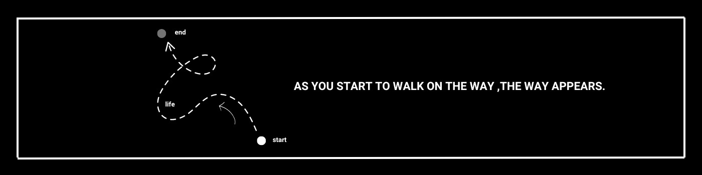

# Hi, I'm [Aishani Singh] 👋  
 AI/ML Enthusiast |  Software Developer |  Problem Solver  

## 🔥 About Me  
- 🔭 Student in Amity University Punjab  
- 📚 Preparing for placements  
- 🌱 Learning Advanced ML  
- 💬 Ask me about Python, AI, and ML  
- ⚡ Fun fact: I love exploring new AI applications  

---

## ⚡ Tech Stack  

---
## 🏆 Featured Projects  

### 🎭 Deepfake Detection (Audio & Video)  
🔗 [GitHub Repo](your_repo_link)  
📝 **Description**: Detects deepfake media using AI-based audio-visual analysis.  

### 🎓 AI-Powered Proctoring System  
🔗 [GitHub Repo](your_repo_link)  
📝 **Description**: Ensures fair online exams by detecting face presence, multiple people, and suspicious movements.  

---

## 📫 Connect with Me  

  
  
  

---

⭐ **Feel free to explore my repositories and connect with me!**  

